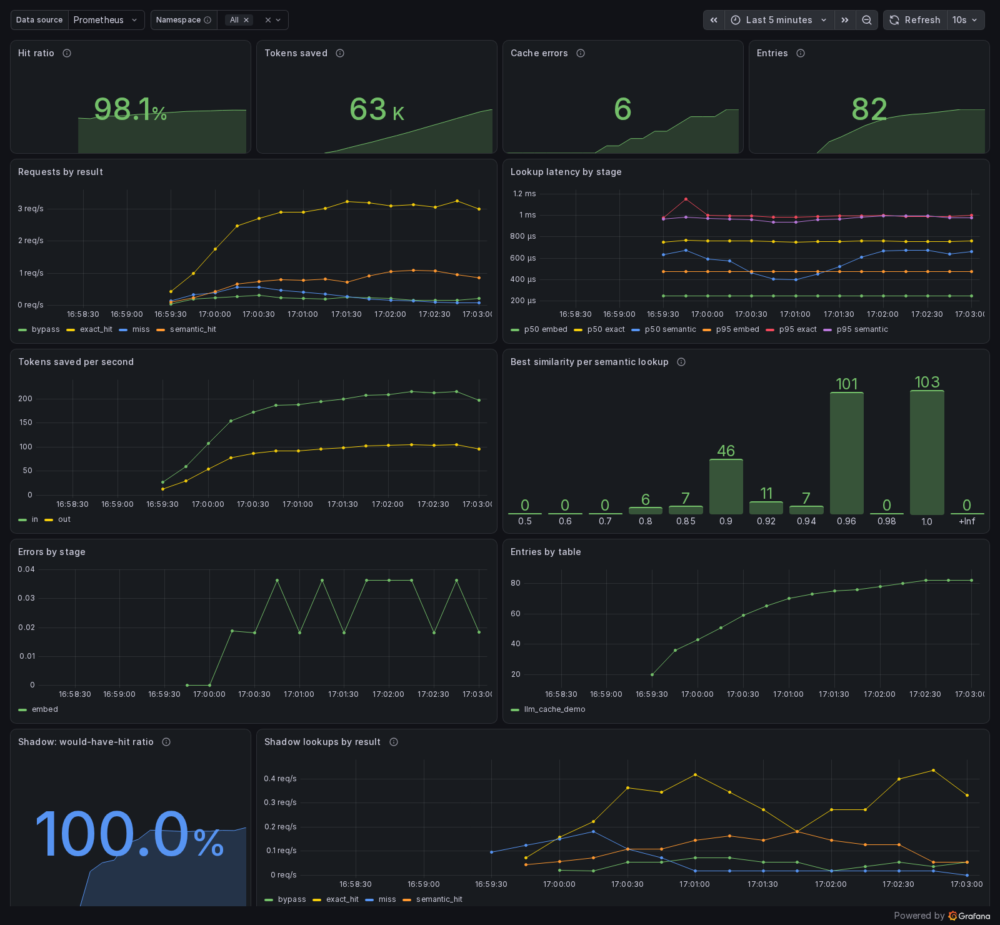

# llm-cache-pg

[English](README.md)

**Cache semântico para chamadas de LLM em TypeScript, sobre PostgreSQL puro + pgvector.** Roda em qualquer Postgres com pgvector (RDS, Supabase, Neon, self-hosted), sem extensão customizada para instalar. Envolve sua chamada à OpenAI ou à Anthropic em uma linha, isola os dados por tenant e exporta métricas para o Prometheus.

> **Status: v0.3.** Antes da 1.0, a API ainda pode mudar entre versões minor (veja o [changelog](CHANGELOG.md)).

---

## Por quê

Apps com LLM recebem a mesma pergunta com palavras diferentes o tempo todo. "How do I reset my password?" e "How can I reset my password?" não deveriam custar duas chamadas ao modelo.

Um cache semântico gera o embedding do prompt, procura uma pergunta parecida o bastante que já foi respondida e devolve a resposta guardada em vez de chamar o modelo.

As opções que existem não servem para uma stack típica de TypeScript + Postgres:

| Opção | Por que não serve |
| --- | --- |
| [pg_semantic_cache](https://github.com/pgedge/pg_semantic_cache) | Extensão de Postgres em C/PLpgSQL: exige `make install` e superusuário, então não roda em Postgres gerenciado. Sem integração do lado da aplicação. |
| [@upstash/semantic-cache](https://www.npmjs.com/package/@upstash/semantic-cache) | Preso ao Upstash Vector; último release em nov/2024. |
| GPTCache, RedisVL | Só Python. |

O `llm-cache-pg` vive na sua aplicação, usa o Postgres que você já tem e só precisa da extensão `vector`, que os provedores gerenciados já liberam.

**Requisitos:** Node 22+, PostgreSQL com pgvector 0.8+ (versões mais antigas funcionam, com buscas semânticas mais fracas em namespaces cheios). Sem dependências em runtime no núcleo: você fornece o pool do `pg` e, se quiser, o client de um SDK. O CI roda a suíte de integração em pgvector 0.8.6 / Postgres 18, 0.8.0 / Postgres 13 e 0.7.4 / Postgres 17.

## Funcionalidades

- **Busca exata + semântica:** primeiro por hash (grátis), depois por similaridade de vetor.
- **Wrappers de uma linha** para os SDKs da OpenAI e da Anthropic, mais um `cache.wrap(fn)` genérico.
- **Chaves seguras:** a requisição inteira faz parte da chave, menos a última mensagem do usuário, que é a única parte comparada por vetor. Modelo, system prompt, turnos anteriores, temperatura, tools e qualquer campo que o SDK adicione no futuro precisam bater exatamente.
- **Fail-open:** se o banco ou o embedder estiverem fora do ar ou lentos, a chamada vai direto para o modelo e o erro vai para o `onError`.
- **Multi-tenant** via `namespace`: nunca há hit entre tenants.
- **TTL** por cache ou por chamada, `prune()` para entradas expiradas e `invalidate()` por namespace, modelo ou chave.
- **Métricas para o Prometheus** via `llm-cache-pg/prometheus`, com `@prometheus-io/client` ou `prom-client`.
- **Traga seu embedder:** embeddings da OpenAI já incluídos, ou qualquer `(text, { signal }) => Promise<number[]>`.
- **Migração** como função ou como SQL puro para a sua ferramenta de migração, com índice HNSW.

Inclui um dashboard do Grafana e um demo de métricas executável.

## Começo rápido

```sh
npm install llm-cache-pg pg
npm install openai               # ou @anthropic-ai/sdk, para os wrappers
```

```ts
import pg from "pg";
import OpenAI from "openai";
import { createCache, migrate } from "llm-cache-pg";
import { openaiEmbedder, withCache } from "llm-cache-pg/openai";

const pool = new pg.Pool({ connectionString: process.env.DATABASE_URL });
const openai = new OpenAI();

await migrate(pool, { dimensions: 1536 }); // idempotente, pode rodar em todo startup

const cache = createCache({
  pool,
  embed: openaiEmbedder({ client: openai, model: "text-embedding-3-small" }),
  threshold: 0.92, // similaridade de cosseno necessária para um hit semântico
  ttl: "7d",
});

// Opção 1: envolver o client
const ai = withCache(openai, cache, { namespace: tenantId });
const res = await ai.chat.completions.create({ model: "gpt-4.1-mini", messages });

// O mesmo para a Anthropic. Usando os dois? Dê um alias a um deles:
// import { withCache as withAnthropicCache } from "llm-cache-pg/anthropic";

// Opção 2: envolver qualquer chamada cujo resultado seja JSON
const answer = await cache.wrap(() => callSomeModel(messages), {
  namespace: tenantId,
  key: { model: "some-model", messages, params: { temperature: 0 } },
});

// No desligamento: esperar as gravações em segundo plano e fechar o pool
await cache.flush();
await pool.end();
```

Uma versão executável está em [examples/openai-basic](examples/openai-basic/index.ts): copie o `.env.example` para `.env`, coloque sua chave da OpenAI e rode `docker compose -f examples/docker-compose.yml up -d && pnpm example`.

## O que nunca é cacheado

- Os helpers de stream dos SDKs (`chat.completions.stream()`, `messages.stream()`), `n > 1` e áudio: vão direto para o SDK. O `create({ stream: true })` é cacheado (veja abaixo).
- Requisições cuja última mensagem não é do usuário ou tem partes que não são texto, como imagens.
- Respostas com tool calls, ou que não terminaram normalmente (`finish_reason` diferente de `stop`; `stop_reason` diferente de `end_turn` ou `stop_sequence`).

Nos dois wrappers, os resultados voltam como Promises comuns, então `.withResponse()` não está disponível. Na Anthropic, os tokens gravados incluem leituras e escritas do prompt cache.

### Streaming

O `create({ stream: true })` também passa pelo cache. Num miss, você recebe o stream do SDK intacto, e a resposta é gravada quando o stream termina normalmente. Num hit, você recebe um `Stream` de verdade do SDK que reproduz a resposta gravada, então `for await`, `tee()` e `toReadableStream()` funcionam como sempre.

- Nada é gravado se o stream for abortado, der erro, for interrompido, chamar tools ou (por enquanto) tiver algo além de texto. Parar de ler com `break` conta como interrompido, inclusive um `break` no chunk final.
- Pedidos com e sem stream são cacheados separadamente.
- A reprodução manda a resposta inteira num único chunk de conteúdo, e não token a token.

## Escolhendo o threshold

Medido com `text-embedding-3-small` (similaridade de cosseno):

| Par | Similaridade |
| --- | --- |
| "How do I reset my password?" / "How can I reset my password?" | 0,961 |
| "How do I reset my password?" / "how do i reset my password" | 0,908 |
| "cancel my order" / "cancel my subscription" | 0,733 |
| "How do I reset my password?" / "I forgot my password, what should I do?" | 0,691 |
| "How do I reset my password?" / "How do I cancel my subscription?" | 0,468 |

Uma pergunta parecida, mas com outra resposta, pode ter nota maior que uma paráfrase de verdade. Por isso nenhum threshold pega reformulações soltas sem também servir respostas erradas. O default de 0,92 só aceita reformulações próximas. Baixe esse valor só depois de medir com o seu próprio tráfego.

O threshold e a busca semântica podem ser definidos por chamada, então cada tenant ou rota tem o seu:

```ts
// Um bot de FAQ estreito, que você já mediu:
const faq = withCache(openai, cache, { namespace: "faq", threshold: 0.88 });
// Perguntas abertas: só repetições exatas. Sem chamadas de embedding, sem falso hit.
const chat = withCache(openai, cache, { namespace: tenantId, semantic: false });
```

Entradas só exatas são gravadas sem embedding, o que exige o schema do `migrate()` da 0.4 ou mais nova.

## Benchmark

1000 pares de perguntas do [Quora Question Pairs](https://huggingface.co/datasets/nyu-mll/glue) (split de validação, 326 rotulados como duplicatas), rodados pela própria biblioteca contra Postgres 18 + pgvector 0.8.6. A primeira pergunta de cada par é gravada, depois a segunda é consultada. **Taxa de hit** é a fração dos pares duplicados respondidos pelo cache; **taxa de falso hit** é a fração das respostas servidas cujo par está rotulado como *não* duplicado.

| Threshold | Hit (3-small) | Falso hit (3-small) | Hit (3-large, 2000 dims) | Falso hit (3-large) |
| --- | --- | --- | --- | --- |
| 0,85 | 46,3% (151) | 24,0% (53) | 47,5% (155) | 18,8% (39) |
| 0,90 | 29,1% (95) | 20,3% (26) | 25,2% (82) | 21,0% (22) |
| **0,92** (default) | **20,6% (67)** | **19,5% (17)** | **20,6% (67)** | **15,0% (12)** |
| 0,94 | 14,7% (48) | 14,3% (8) | 14,1% (46) | 14,8% (8) |
| 0,96 | 8,0% (26) | 10,3% (3) | 6,7% (22) | 12,0% (3) |

Como ler:

- A taxa de falso hit é um teto. Os rótulos do Quora têm ruído: de 8 "falsos hits" acima de 0,94 conferidos à mão, cerca de metade era de fato a mesma pergunta ("What brand of socks is this?" / "…are these?"). O resto eram respostas erradas de verdade, como "How do I migrate my **Clash Royale** account…" servida para "…my **Clash of Clans** account…" com 0,956.
- Uma pergunta parecida pode ter nota tão alta quanto uma paráfrase real. Por isso, subir o threshold reduz os falsos hits devagar, enquanto os hits caem rápido. Hits semânticos compensam em tráfego estreito e repetitivo (suporte, FAQ), onde dá para conferir as respostas; em perguntas abertas, conte com os hits exatos.
- Num conjunto pequeno de suporte escrito à mão (`bench/data/faq.json`, 10 paráfrases e 10 armadilhas por idioma), o default 0,92 respondeu 1/10 paráfrases em inglês com o 3-small e 0/10 com o 3-large, 0/10 em português com qualquer um, e não serviu nenhuma das 20 armadilhas. Só ilustrativo, pelo tamanho.
- Custo do lookup num banco local aquecido: exato p50 0,4 ms, semântico p50 1,3 ms / p95 1,8 ms com 1536 dimensões (7,8 / 9,3 ms com 2000).

Reproduza com `pnpm bench` (precisa de Docker e `OPENAI_API_KEY`; os embeddings ficam em cache em `bench/.cache`). Os resultados brutos estão em [bench/results](bench/results). Os dados do Quora são baixados, não redistribuídos.

## Opções

| Opção | Default | |
| --- | --- | --- |
| `pool` | obrigatório | Um `pg.Pool`, ou qualquer coisa com `query` e `connect` |
| `embed` | obrigatório | `(text, { signal }) => Promise<number[]>` |
| `threshold` | `0.92` | Similaridade de cosseno para um hit semântico; também por chamada |
| `semantic` | `true` | `false` para só hits exatos, sem chamadas de embedding; também por chamada |
| `ttl` | nenhum | `"30s"`, `"15m"`, `"7d"`, ms ou `null` |
| `table` | `llm_cache_entries` | Precisa ser a mesma do `migrate()` |
| `lookupTimeoutMs` | `200` | Por consulta ao banco, aplicado no client e no servidor |
| `embedTimeoutMs` | `5000` | Para a chamada de embedding, que é abortada depois disso |
| `awaitStore` | `false` | Esperar a gravação num miss; se não, chame `cache.flush()` antes de desligar |
| `onError` | `console.warn` | `(error, stage)`, nunca recebe o texto do prompt nem da resposta |
| `onLookup` | nenhum | `({ result, namespace, similarity })` a cada busca |

## Métricas

```ts
import * as client from "@prometheus-io/client"; // ou "prom-client"
import { prometheusHooks } from "llm-cache-pg/prometheus";

const cache = createCache({ pool, embed, ...prometheusHooks({ client, pool }) });
```

| Métrica | Tipo | Labels |
| --- | --- | --- |
| `llm_cache_requests_total` | counter | `result`: exact_hit, semantic_hit, miss, bypass; `namespace` se `namespaceLabel: true` |
| `llm_cache_tokens_saved_total` | counter | `direction`: in, out |
| `llm_cache_lookup_duration_seconds` | histogram | `stage`: exact, embed, semantic |
| `llm_cache_similarity` | histogram | nenhum; melhor nota de cada busca semântica |
| `llm_cache_errors_total` | counter | `stage` |
| `llm_cache_entries` | gauge | `table`; vem das estatísticas do Postgres, só quando `pool` é passado |

Um dashboard do Grafana está em [grafana/dashboard.json](grafana/dashboard.json). Para vê-lo com tráfego ao vivo, sem chave de API:

```sh
pnpm build && docker compose -f examples/metrics/docker-compose.yml up
# abra http://localhost:3000
```



O demo manda perguntas de suporte sintéticas pelo cache, com modelo e embedder falsos, então o hit ratio dele não diz nada sobre tráfego real. Com `OPENAI_API_KEY` no `.env`, ele usa embeddings da OpenAI (`DEMO_OFFLINE=1` força os falsos); o modelo continua falso.

Os hooks substituem o `onError`, então os erros são contados em vez de logados; combine os dois se quiser ambos. O label de namespace vem desligado, porque uma série por tenant pode sobrecarregar o Prometheus.

## Limpeza

```ts
await cache.prune();                              // apaga entradas expiradas, em lotes de 1000
await cache.invalidate({ namespace: tenantId });  // tudo de um tenant
await cache.invalidate({ model: "gpt-4.1-mini" }); // depois de trocar de modelo
await cache.invalidate({ key: { model, messages }, namespace: tenantId }); // uma resposta errada
```

Rode o `prune()` periodicamente se usar TTL: entradas expiradas nunca são servidas, mas ficam na tabela até lá. As duas chamadas lançam erro se falharem, ao contrário das buscas. Depois de apagar muitas linhas, um `VACUUM` deixa o Postgres reaproveitar o espaço do índice HNSW.

## Usando sua própria ferramenta de migração

`renderMigrationSql({ table, dimensions })` devolve o SQL idempotente que o `migrate()` executa, para colar em migrações do Prisma, Drizzle ou Flyway.

## Desenvolvimento

```sh
pnpm install
pnpm test            # unitários + integração; a integração sobe o pgvector no Docker via Testcontainers
pnpm test:consumer   # empacota a biblioteca e instala num projeto novo
PGVECTOR_IMAGE=pgvector/pgvector:0.7.4-pg17 pnpm test:integration  # outro pgvector/Postgres
pnpm bench           # benchmark (Docker + OPENAI_API_KEY)
```

Leia o [CONTRIBUTING.md](CONTRIBUTING.md) (em inglês) antes de abrir um pull request.

## Roadmap

- [x] v0.1: busca e gravação, wrapper da OpenAI, migração SQL, testes contra Postgres real
- [x] v0.2: wrapper da Anthropic, prune/invalidate, métricas para o Prometheus, matriz de versões do pgvector, benchmark
- [x] v0.3: dashboard do Grafana, demo de métricas, publicação no npm
- [ ] depois: respostas com streaming, threshold por namespace, CLI de administração

## Licença

[MIT](LICENSE)
